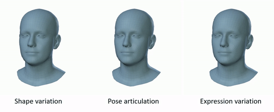
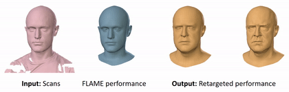

## FLAME: Faces Learned with an Articulated Model and Expressions

This is an official [FLAME](http://flame.is.tue.mpg.de/) repository. This repository is based on [Chumpy](https://github.com/mattloper/chumpy). We also provide a [Tensorflow-based FLAME framework](https://github.com/TimoBolkart/TF_FLAME).  

FLAME is a lightweight and expressive generic head model learned from over 33,000 of accurately aligned 3D scans. 

<p align="center"> 

</p>

FLAME combines a linear identity shape space (trained from 3800 scans of human heads) with an articulated neck, jaw, and eyeballs, pose-dependent corrective blendshapes, and additional global expression blendshapes. 

FLAME can e.g. be used to synthesize new motion sequences, by transferring the facial expression from a source actor to a target actor.

<p align="center"> 

</p>

The animation shows the expression transfer between two subjects. For the target subject, only a static mesh is provided. For details please see the [scientific publication](https://ps.is.tuebingen.mpg.de/uploads_file/attachment/attachment/400/paper.pdf)

```
Learning a model of facial shape and expression from 4D scans
Tianye Li*, Timo Bolkart*, Michael J. Black, Hao Li, and Javier Romero
ACM Transactions on Graphics (Proc. SIGGRAPH Asia) 2017
```
and the [supplementary video](https://youtu.be/36rPTkhiJTM).

This codebase demonstrates how to
 * Load and evaluate FLAME model
 * Fit FLAME model to 3D landmarks

To request for FLAME model and registrations, please see the [project page](http://flame.is.tue.mpg.de)

This repo is maintained by [Tianye Li](https://sites.google.com/site/tianyefocus/). The codes in `smpl_webuser` are directly from [SMPL Python code](http://smpl.is.tue.mpg.de/).

### Dependencies

This code uses Python 2.7 and need the following dependencies:

- [numpy & scipy](http://www.scipy.org/scipylib/download.html)
- [opencv](http://opencv.org/)
- [chumpy](https://github.com/mattloper/chumpy)

### Set-up

Clone the git project:
```
$ git clone https://github.com/Rubikplayer/flame-fitting.git
```

Set up virtual environment:
```
$ mkdir <your_home_dir>/.virtualenvs
$ virtualenv --system-site-packages <your_home_dir>/.virtualenvs/flame
```

Activate virtual environment:
```
$ cd flame-fitting
$ source <your_home_dir>/.virtualenvs/flame/bin/activate
```

Update the PYTHONPATH environment variable so that the system knows how to find the SMPL code. Add the following lines to your ~/.bash_profile file (create it if it doesn't exist; Linux users might have ~/.bashrc file instead), set the location to where you clone the project to.
```
FLAME_LOCATION=<flame_project_dir>
export PYTHONPATH=$PYTHONPATH:$FLAME_LOCATION
```

and run:
```
$ source ~/.bash_profile
```

To install numpy, scipy and chumpy:
```
$ pip install numpy
$ pip install scipy
$ pip install chumpy
```
To deactivate the virtual environment:
```
$ deactivate
```

### Demo

See `hello_world.py` and `facefit_lmk3d.py` for the demos.

### Supported projects

FLAME supports several projects such as
* [VOCA: Voice Operated Character Animation](https://github.com/TimoBolkart/voca)
* [RingNet: 3D Face Shape and Expression Reconstruction from an Image without 3D Supervision](https://github.com/soubhiksanyal/RingNet)

### Citing

When using this code in a scientific publication, please cite FLAME 
```
@article{FLAME:SiggraphAsia2017,
  title = {Learning a model of facial shape and expression from {4D} scans},
  author = {Li, Tianye and Bolkart, Timo and Black, Michael. J. and Li, Hao and Romero, Javier},
  journal = {ACM Transactions on Graphics, (Proc. SIGGRAPH Asia)},
  volume = {36},
  number = {6},
  year = {2017},
  url = {https://doi.org/10.1145/3130800.3130813}
}
```

### License

The FLAME model is under a Creative Commons Attribution license. By using this code, you acknowledge that you have read the terms and conditions (http://flame.is.tue.mpg.de/model_license), understand them, and agree to be bound by them. If you do not agree with these terms and conditions, you must not use the code. You further agree to cite the FLAME paper when reporting results with this model.

