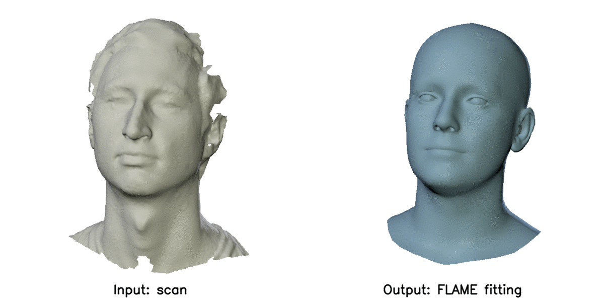
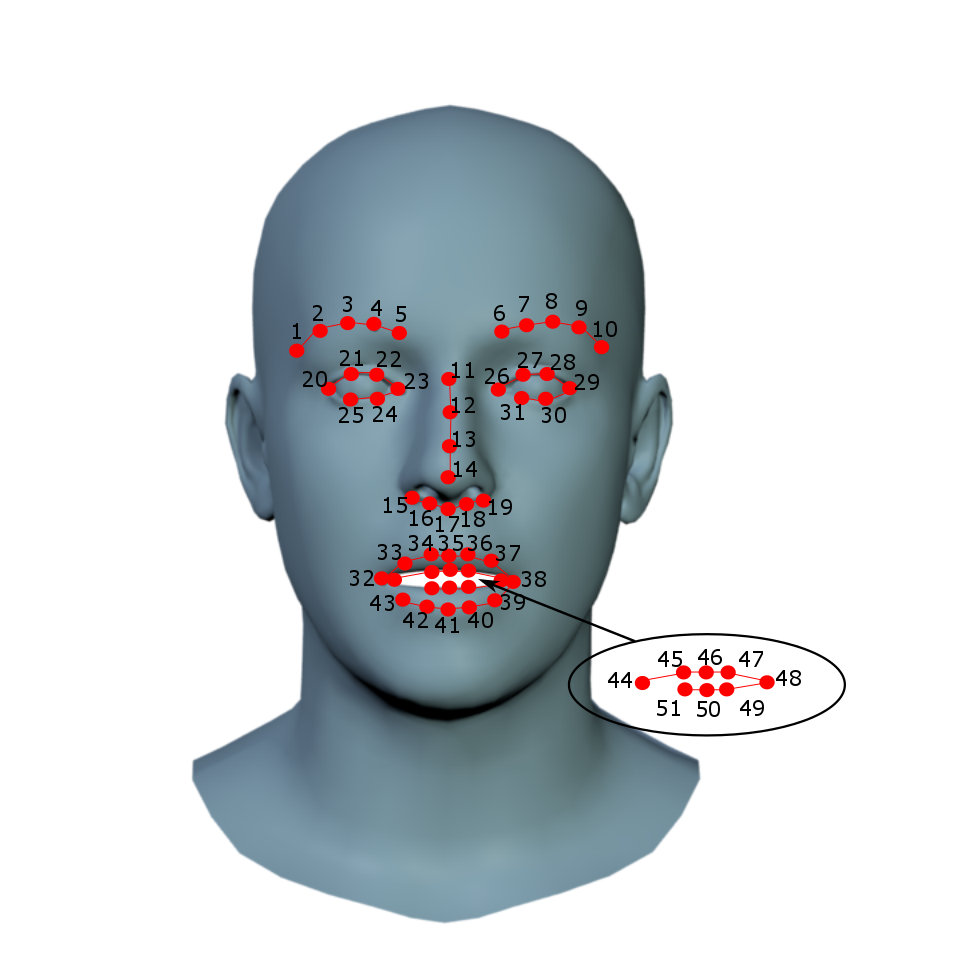

# FLAME: Articulated Expressive 3D Head Model

This is an official [FLAME](http://flame.is.tue.mpg.de/) repository. 

We also provide [Tensorflow FLAME](https://github.com/TimoBolkart/TF_FLAME) and [PyTorch FLAME](https://github.com/HavenFeng/photometric_optimization) frameworks, and code to [convert from Basel Face Model to FLAME](https://github.com/TimoBolkart/BFM_to_FLAME).

<p align="center"> 

</p>

FLAME is a lightweight and expressive generic head model learned from over 33,000 of accurately aligned 3D scans. FLAME combines a linear identity shape space (trained from head scans of 3800 subjects) with an articulated neck, jaw, and eyeballs, pose-dependent corrective blendshapes, and additional global expression blendshapes. For details please see the [scientific publication](https://ps.is.tuebingen.mpg.de/uploads_file/attachment/attachment/400/paper.pdf)

```
Learning a model of facial shape and expression from 4D scans
Tianye Li*, Timo Bolkart*, Michael J. Black, Hao Li, and Javier Romero
ACM Transactions on Graphics (Proc. SIGGRAPH Asia) 2017
```
and the [supplementary video](https://youtu.be/36rPTkhiJTM).

This codebase demonstrates
 * **Sampling:** Load and evaluate FLAME model for random parameters
 * **Landmark fitting:** Fit FLAME to 3D landmarks
 * **Scan fitting:** Fit FLAME to a 3D scan

<p align="center"> 

</p>

### Set-up

The code has been tested with Python 3.6.9.

Clone the git project:
```
git clone https://github.com/Rubikplayer/flame-fitting.git
```

Install pip and virtualenv

```
sudo apt-get install python3-pip python3-venv
```

Set up virtual environment:
```
mkdir <your_home_dir>/.virtualenvs
python3 -m venv <your_home_dir>/.virtualenvs/flame-fitting
```

Activate virtual environment:
```
cd flame-fitting
source <your_home_dir>/.virtualenvs/flame-fitting/bin/activate
```

Make sure your pip version is up-to-date:
```
pip install -U pip
```

Somerequirements can be installed using:
```
pip install -r requirements.txt
```

Install mesh processing libraries from [MPI-IS/mesh](https://github.com/MPI-IS/mesh) within the virtual environment.

The scan-to-mesh distance used for fitting a scan depends on Eigen. Either download Eigen for [here](http://eigen.tuxfamily.org/index.php?title=Main_Page) OR clone the repository:
```
git clone https://gitlab.com/libeigen/eigen.git
```
After downloading Eigen, you need to compile the code in the directory 'sbody/alignment/mesh_distance'. To do this go to the directory:
```
cd sbody/alignment/mesh_distance
```
Edit the file setup.py to set EIGEN_DIR to the location of Eigen. Then type:
```
make
```

### Data

Download the FLAME model [MPI-IS/FLAME](https://flame.is.tue.mpg.de/downloads). You need to sign up and agree to the model license for access to the model.

### Demo

 * Load and evaluate FLAME model: `hello_world.py`
 * Fit FLAME to 3D landmarks: `fit_lmk3d.py`
 * Fit FLAME to a 3D scan: `fit_scan.py`

Fitting a scan requires scan and FLAME model to be in the same local coordiante systems. The `fit_scan.py` script provides different options by specifying the variable `scale_unit` to convert from Meters [m] (default), Centimeters [cm], or Milimieters [mm]. Please specify the right unit when running `fit_scan.py`. If the unit of the measurement unit is unknown, choose `scale_unit = 'NA'`.

### Landmarks

<p align="center"> 

</p>

The provided demos fit FLAME to 3D landmarks or to a scan, using 3D landmarks for initialization and during fitting. Both demos use the shown 51 landmarks. Providing the landmarks in the exact order is essential. The landmarks can for instance be obtained with [MeshLab](https://www.meshlab.net/) using the PickPoints module. PickPoints outputs a .pp file containing the selected points. The .pp file can be loaded with the provided 'load_picked_points(fname)' function in fitting/landmarks.py.
 
### Citing

When using this code in a scientific publication, please cite FLAME 
```
@article{FLAME:SiggraphAsia2017,
  title = {Learning a model of facial shape and expression from {4D} scans},
  author = {Li, Tianye and Bolkart, Timo and Black, Michael. J. and Li, Hao and Romero, Javier},
  journal = {ACM Transactions on Graphics, (Proc. SIGGRAPH Asia)},
  volume = {36},
  number = {6},
  year = {2017},
  url = {https://doi.org/10.1145/3130800.3130813}
}
```

### License

The FLAME model is under a Creative Commons Attribution license. By using this code, you acknowledge that you have read the terms and conditions (https://flame.is.tue.mpg.de/modellicense.html), understand them, and agree to be bound by them. If you do not agree with these terms and conditions, you must not use the code. You further agree to cite the FLAME paper when reporting results with this model.

### Supported projects

FLAME supports several projects such as
* [CoMA: Convolutional Mesh Autoencoders](https://github.com/anuragranj/coma)
* [RingNet: 3D Face Shape and Expression Reconstruction from an Image without 3D Supervision](https://github.com/soubhiksanyal/RingNet)
* [VOCA: Voice Operated Character Animation](https://github.com/TimoBolkart/voca)
* [Expressive Body Capture: 3D Hands, Face, and Body from a Single Image](https://github.com/vchoutas/smplify-x)
* [ExPose: Monocular Expressive Body Regression through Body-Driven Attention](https://github.com/vchoutas/expose)
* [GIF: Generative Interpretable Faces](https://github.com/ParthaEth/GIF)
* [DECA: Detailed Expression Capture and Animation](https://github.com/YadiraF/DECA)

FLAME is part of [SMPL-X: : A new joint 3D model of the human body, face and hands together](https://github.com/vchoutas/smplx)


### Acknowledgement

Code in `smpl_webuser` originates from [SMPL Python code](http://smpl.is.tue.mpg.de/), and code in `sbody` originates from [SMALR](https://github.com/silviazuffi/smalr_online). We thank the authors for pushing these code packages. 
